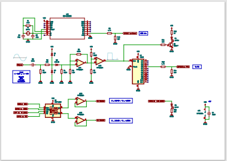
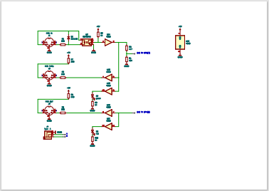
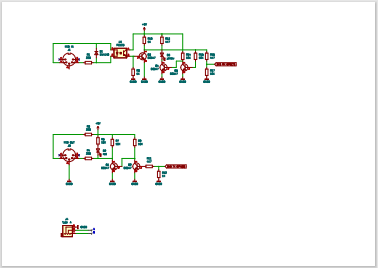
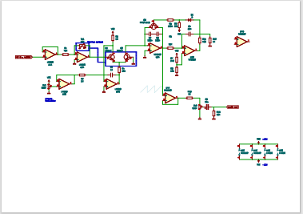

# Pico Frequency Counter

This is a test solution. It includes the following:
* Circuits
    * MIDI
    * Frequency Counter
    * VCO
* Implementation of different protocols 
    * MIDI USB
    * MIDI Serial Port
    * SysEx
    * PuTTY output/inpus (need Pico Probe)
    * SPI
* C# .Net midi tool

Various parts are not 100% complete. It is an attempt to freeze a state and make it available to whoever is interested.

What can you do with it:
* Send midi message in both directions PC <==> Pico
* MIDI USB and serial
* Make a midi interface yourself DIN-5/TRS
* Send a midi note
* Send a midi SysEx message
* Logging midi messages
* Support for MiniLab3 and knobe Relative1/Relative2 mode
* Frequency counter with signal input +/- 0.5V .. +/-12V
* Two cores suport
* Automatic creation of VCO voltage table
* MIDI to CV

All this could be a good start to experiment with pico and synth VCO.

## Circuits

Frequency Counter [pdf](pdf/frequencyCounter.pdf)

MiDI 1 [pdf](pdf/midiPico.pdf)

MiDI 2 [pdf](pdf/midiPicoTransistor.pdf)

VCO [pdf](pdf/vco.pdf)

## References

https://github.com/richardjkendall/rp2040-freq-counter

https://chart-studio.plotly.com/create/#/

https://github.com/polykit/pico-dco