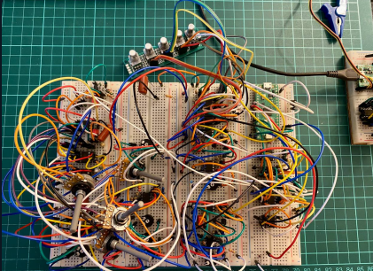
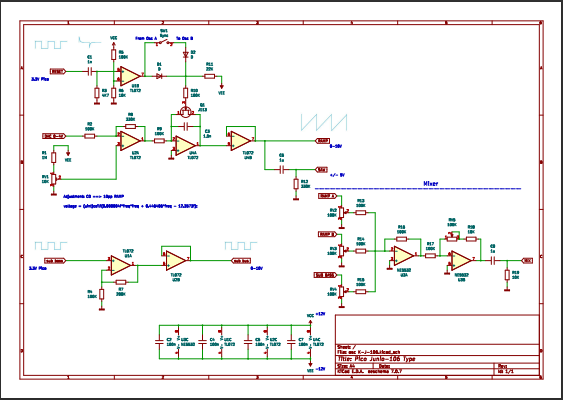
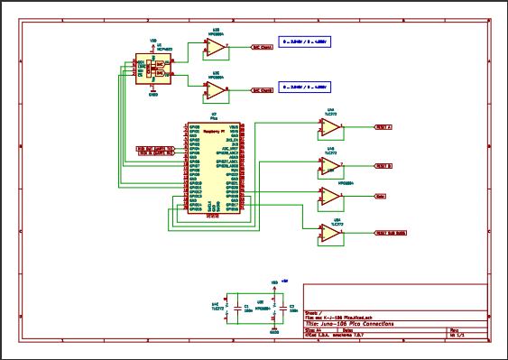
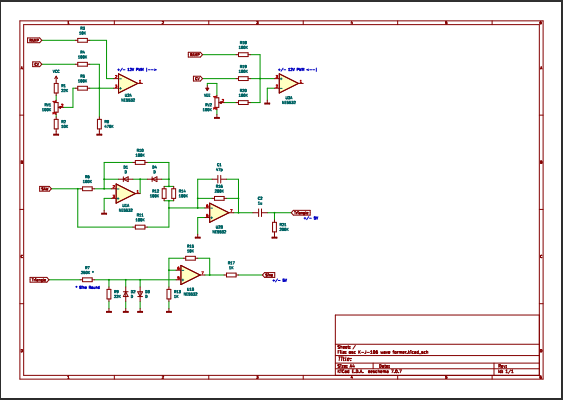
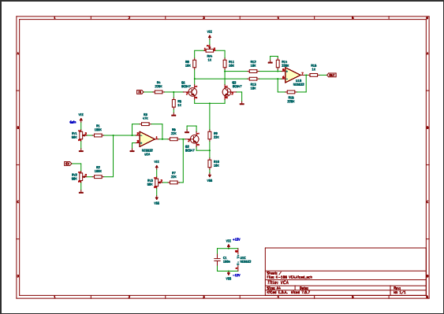
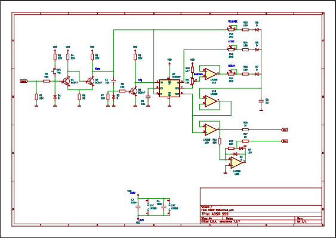
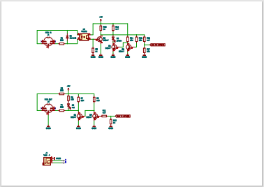

# K-106 Pico Synth

This is a test solution. It includes the following:

* Circuits
    * VCO like Juno-106 ("2x osc + sub bass)
    * Mixer
    * Wave Former
    * VCA
    * ADSR
    * MIDI    

* Implementation of different protocols 
    * MIDI USB
    * MIDI Serial Port
    * PuTTY output/inpus (need Pico Probe)
    * SPI

K-106 [jpg](pdf/K-106-foto.jpg)

Various parts are not 100% complete. It is an attempt to freeze a state and make it available to whoever is interested.

All this could be a good start to experiment with pico and synth VCO.

## Circuits

VCO [pdf](pdf/K-106-Osc.pdf)

Pico [pdf](pdf/K-106-Pico.pdf)

Wave Former [pdf](pdf/K-106-Waveformer.pdf)

VCA [pdf](pdf/K-106-VCA.pdf)

ADSR [pdf](pdf/K-106-ADSR.pdf)

MiDI [pdf](pdf/midiPicoTransistor.pdf)

## References

https://blog.thea.codes/the-design-of-the-juno-dco/

https://electricdruid.net/roland-juno-dcos/

https://github.com/polykit/pico-dco

https://kassu2000.blogspot.com/
