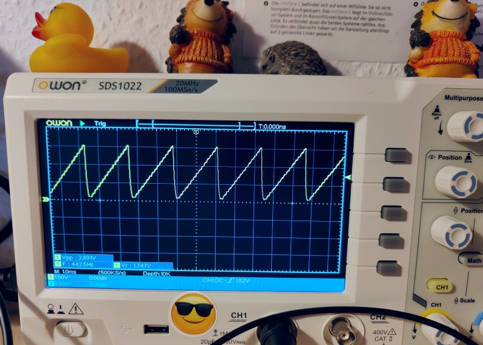
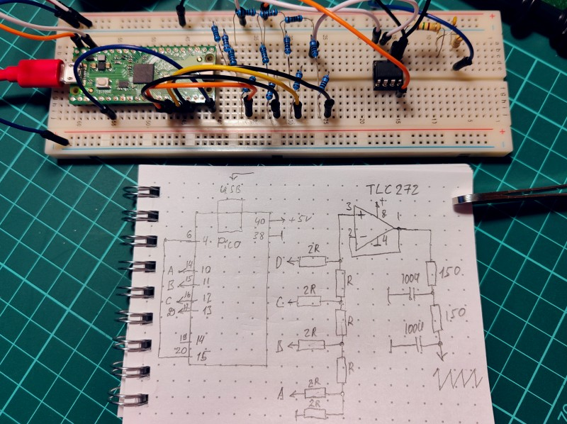
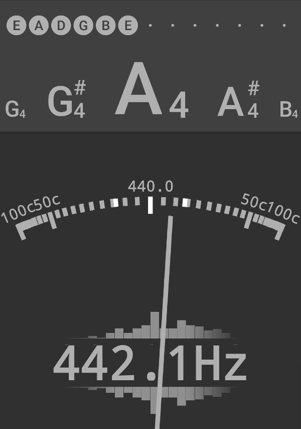

# PWM with 4 bit R-2R DAC oscillator

Sawtooth saw is generated with 4 bit R-2R DAC. Signal is smoothed with RC filter. Callback function is called via pin IRQ. Pin IRQ is controlled by pin PWD. The circuit is also included.

Scope

Circuit

A4

## References

https://www.electronics-tutorials.ws/combination/r-2r-dac.html
