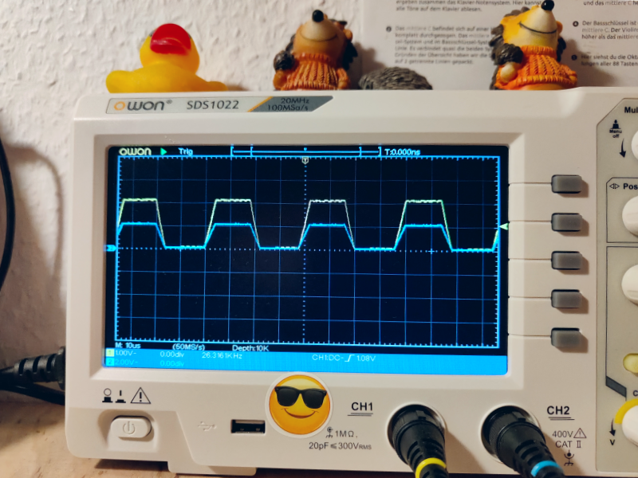
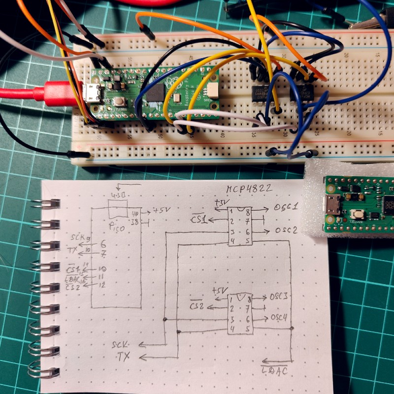

# 4-chanel SPI 12-bit DAC oscillator 

Scope

Yellow is chanel A1, blue is B2 chanel. Oscilators are synchronous, although SPI is serial interface.

Circuit

## References

https://github.com/raspberrypi/pico-examples
